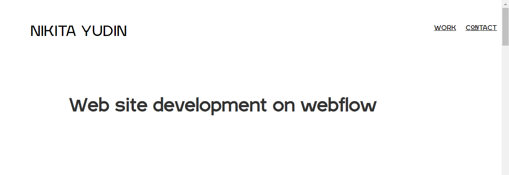
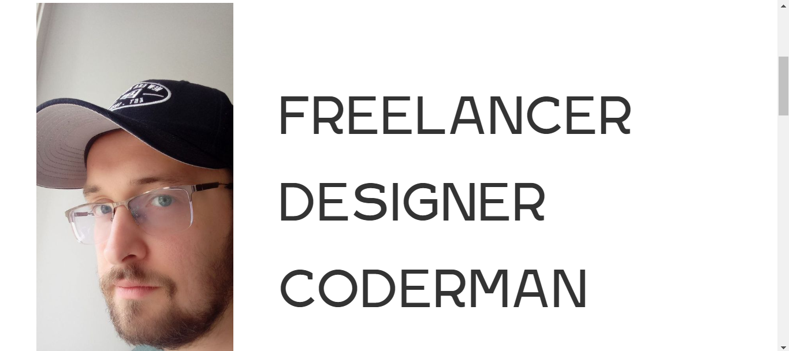
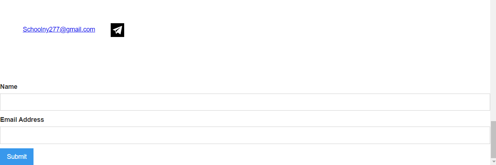

# PORTFOLIO DO NIKITA
☑️EXEMPLO DE PORTFOLIO.

   
   
   
   
   

## DESCRIÇÃO:
O site é um portfólio pessoal ou profissional de Nikita Yudin, mostrando seu trabalho como desenvolvedor web e designer. Ele fornece informações sobre os projetos realizados por Nikita, bem como uma maneira de entrar em contato com ele. Aqui está uma descrição das principais características e funcionalidades do site:

1. **Meta informações**: O código HTML inclui várias meta tags, como título, descrição e viewport, que são importantes para o SEO e a exibição correta do site em diferentes dispositivos.

2. **Links para estilos e scripts**: O código inclui links para arquivos CSS e JavaScript externos que são responsáveis pela estilização e funcionalidade dinâmica do site.

3. **Cabeçalho**: O cabeçalho (`header`) inclui o logotipo do site e links de navegação para as seções "Work" e "Contact".

4. **Seções do site**: O site é dividido em várias seções, como "Development", "Title", "About", "My Work" e "Contact". Cada seção tem seu próprio conteúdo e estilo.

5. **Portfólio**: A seção "My Work" exibe diferentes projetos em cartões, cada um com uma imagem representativa e um link para mais informações sobre o projeto.

6. **Formulário de contato**: A seção "Contact" inclui um formulário de contato onde os visitantes podem inserir seu nome e endereço de e-mail e enviar uma mensagem para o proprietário do site.

## NÃO SABE?
- Entendemos que para manipular arquivos em `HTML`, `CSS` e outras linguagens relacionadas, é necessário possuir conhecimento nessas áreas. Para auxiliar nesse aprendizado, oferecemos cursos gratuitos disponíveis:
* [CURSO DE HTML E CSS](https://github.com/VILHALVA/CURSO-DE-HTML-E-CSS)
* [CURSO DE JAVASCRIPT](https://github.com/VILHALVA/CURSO-DE-JAVASCRIPT)
* [CONFIRA MAIS CURSOS](https://github.com/VILHALVA?tab=repositories&q=+topic:CURSO)

## CREDITOS:
- [PROJETO CRIADO PELO "Nikita Iudin"](https://github.com/Nikita-Iudin/my-site-webflow-donwloading)
- [PROJETO EDITADO PELO VILHALVA](https://github.com/VILHALVA)
